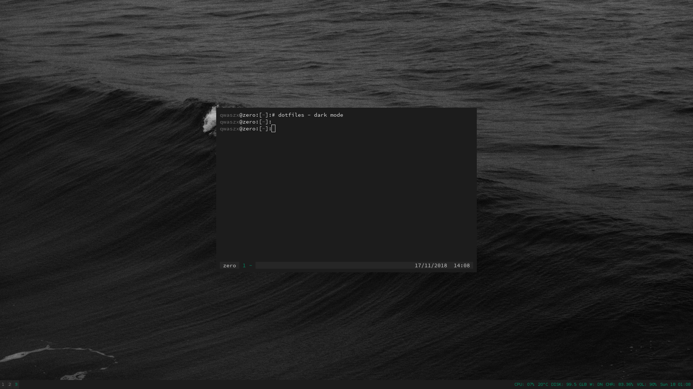

# dotfiles
> *KISS* Keep It Simple, Stupid!


<sub>WM: [i3](https://i3wm.org/) + [i3-gaps](https://github.com/Airblader/i3) | Shell: zsh + [oh-my-zsh](https://github.com/robbyrussell/oh-my-zsh)</sub>

## Install

1. Clone this repository
```
git clone https://gitlab.com/qqwaszx/dotfiles.git ~/.dotfiles
cd ~/.dotfiles
```

2. Install oh-my-zsh and vim
```
# ~/.dotfiles
chmod +x install.sh
bash install.sh
```

2.1 If you use i3, link configuration files.
```
ln -s ~/.dotfiles/i3 ~/.config/i3
```
